# Storage System

# Installation

## Python environment

1. Create environment:
    ```
    python -m venv .venv
    ```

2. Activate environment:
    ```
    .venv\Scripts\activate
    ```

3. Install requirements:
    ```
    pip install -r requirements.txt
    ```

## Create Database

1. Create a mysql database with MySQL workbench or other ways

2. Create a `secrets.json` at `code/data`

3. Add secret information
Example:
```
{   
    "username": "root",
    "password": "root",
    "db_name": "storagesystem",
    "test_db_name": "test_storagesystem",
    "hostname": "localhost"
}
```
4. Create tables and populate with fake data

Go to
```
code/
```
Run
```
python generate_database_data.py
```

## Install Front-end React requirements
1. Install Node.js
    [https://nodejs.org](https://nodejs.org)

2. npm install at app location

Go to
```
code/react/storage-app
```
Run
```
npm install
```
Might have to run
```
npm audit fix --force
```


## Run API and Front-end

1. Launch API service at main.py location

Open 1st terminal and go to
```
code/
```
Run
```
uvicorn main:app --reload
```
Launch browser
```
localhost:8000/docs
```

2. Lauch React Front-end at App location

Open 2nd terminal and go to
```
code/react/storage-app 
```
Run
```
npm start
```
Launch browser
```
localhost:3000
```

3. Login with the generated base users:

| User Type | Username | Password |
| --------- | -------- | -------- |
| Admin     | `admin`  | `admin`  |
| Normal    | `user`   | `user`   |

## Run Tests

Go to
```
code/
```
Run
```
python -m unittest -v test_async.py
```

## Specificaftions

##### Basic requirements
Status | Requirement | Comment
:---:| --- | ---
✅| Products | SQLAlchemy ORM Model
✅| Category | SQLAlchemy ORM Model
✅| Transactions | SQLAlchemy ORM Model
✅| Users | SQLAlchemy ORM Model
⛔| Report Generation | No Front-end page for this was made
✅| Handling of categories | Has subcategories, Add/Update/Delete
✅| Handling of products | Add/Update/Delete
✅| Handling of transactions | Purchase / Restock
✅| Handling of Users | Register / Delete
✅| Transaction History | Sortable
⛔| Terminal Menu | Done with front-end instead


##### Advanced requirements
Status | Requirement | Comment 
:---:| --- | ---
⛔| Stored Procedure |
✅| Logs | Can get function calls with kwargs, message and Status: Fail/OK
✅| User Rights | User.type = "user" / "admin_user"

##### Self imposed extra requirements
Status | Requirement | Comment
:---:| --- | ---
✅| API | Done with FastAPI
✅| Front-end | Done with React


## Known Issues

#### Overall
- When creating a user password isn't encrypted at client side, only backend encrypts before storing.
- secrets.json and config.json with env style setup.
- Some errors aren't nicely handled and we throw some ugly query errors sometimes.
- Project file-structure could give issues with imports

#### Database
- Limited database unittests
- Update function isn't tests, issues with updating with null parameters
- Setup requires a MySQL database to be setup before hand

#### API
- No API tests
- API calls aren't token protected. (API is useable without login, only frontend does "IsAdmin" and "IsLoggedIn" checks)
- Sometimes the Get functions calls twice

#### Front-end
- No front-end react tests
- A non admin user can get everyones transactions with search
- Admin can delete itself
- Delete and Update doesn't update table. We have to refresh first to see result.

## Diagrams

### Overall Full-stack flow
Full stack diagram from SQLAlchemy ORMS -> Connect -> Database Handler -> FastAPI -> React Frontend


### Database Diagram
Database diagram with relationships. Categories referes to itself because of a tree-like parent.id structure to make sub_categories
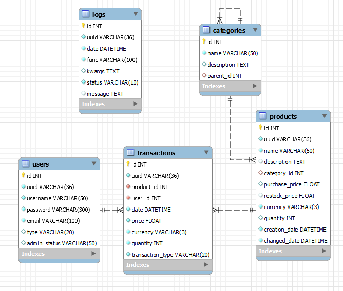

## Fast API Docs
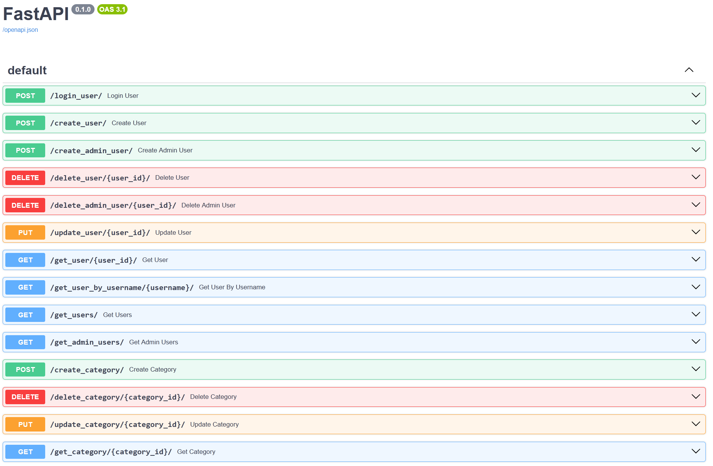
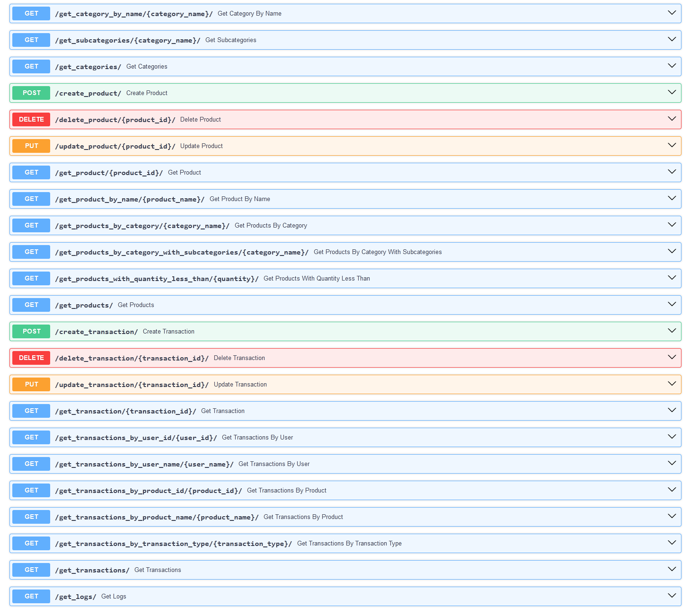

## Frontend Images

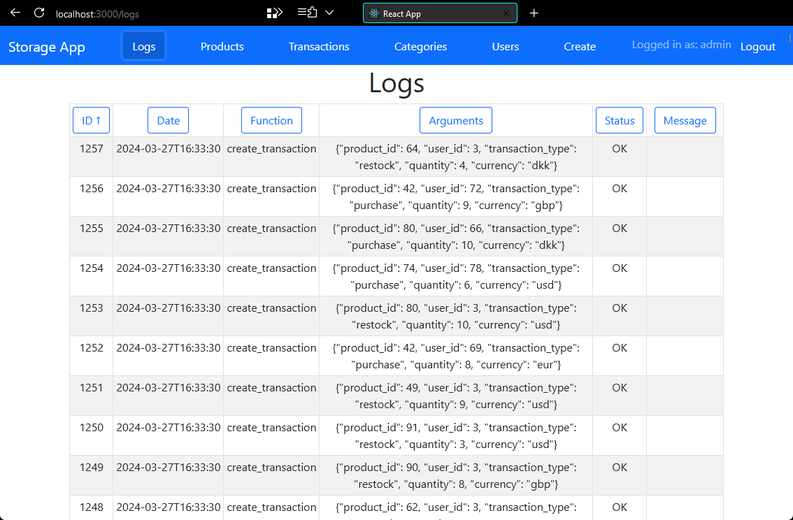
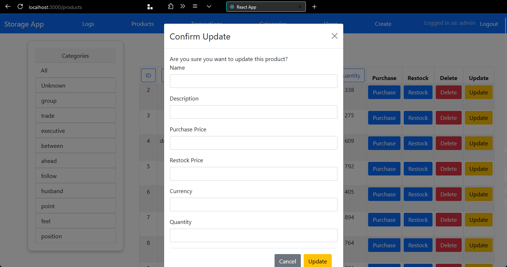
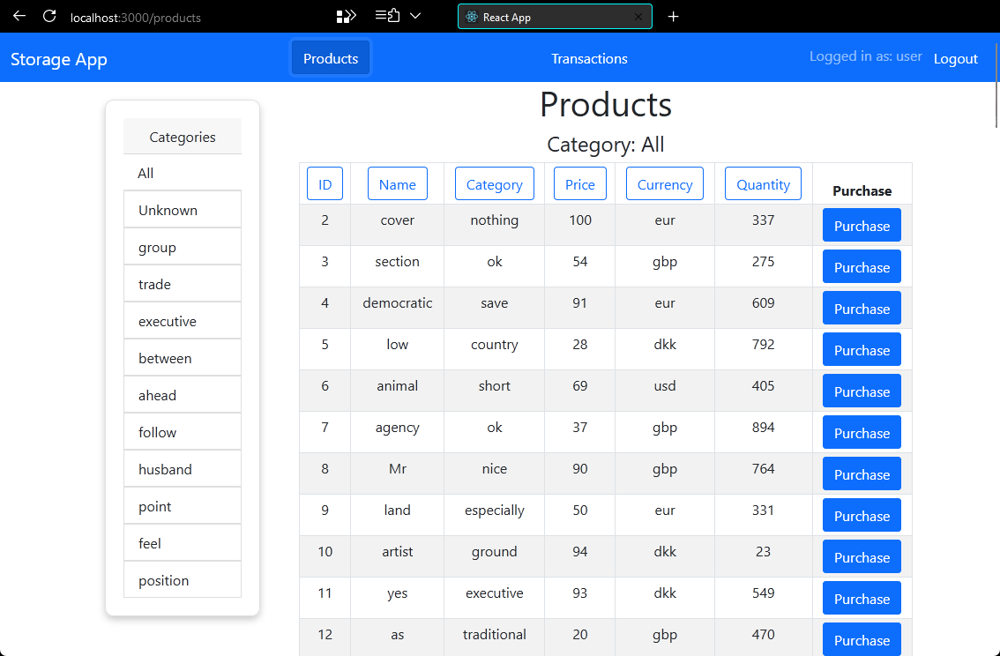
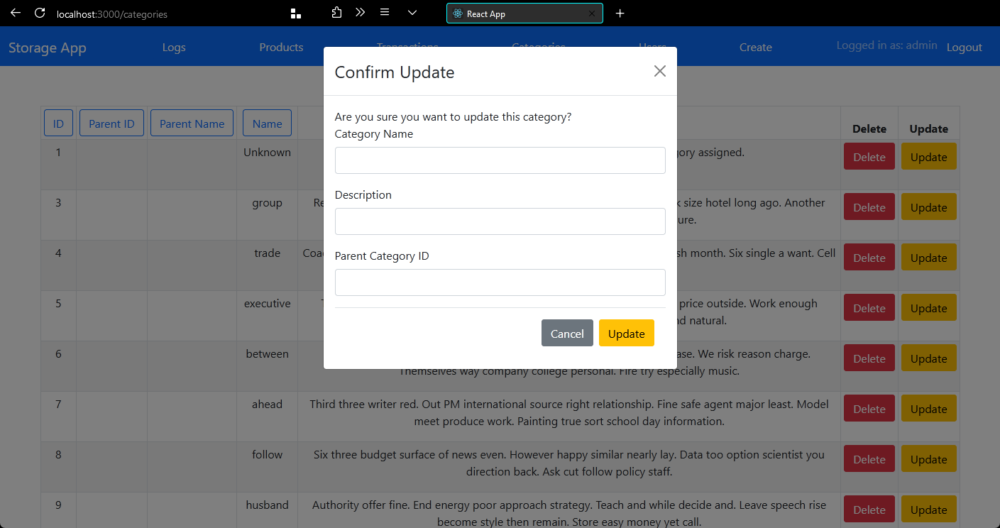
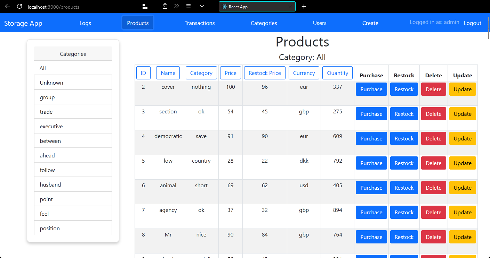
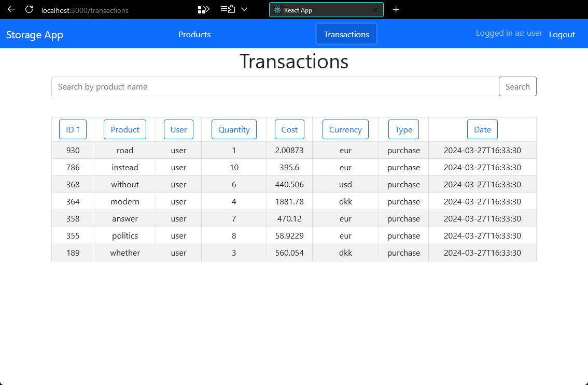
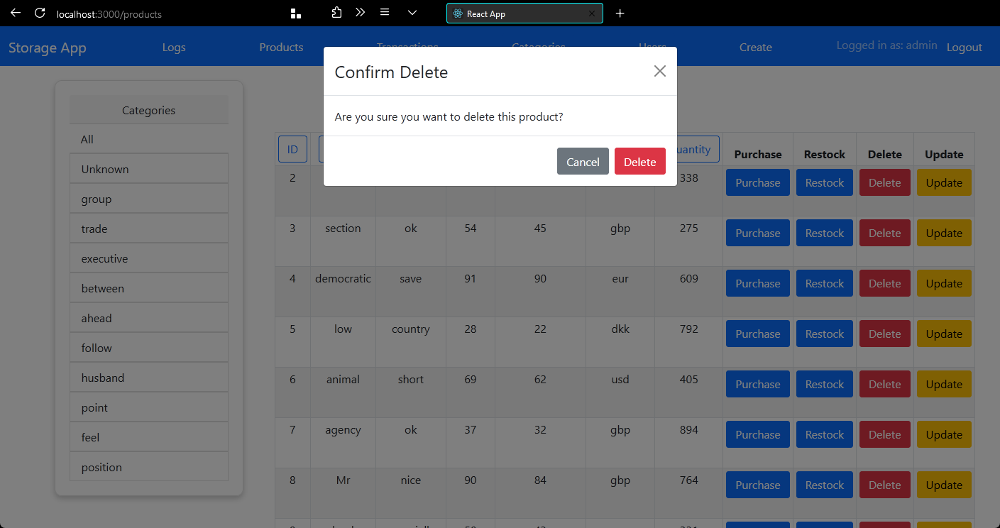
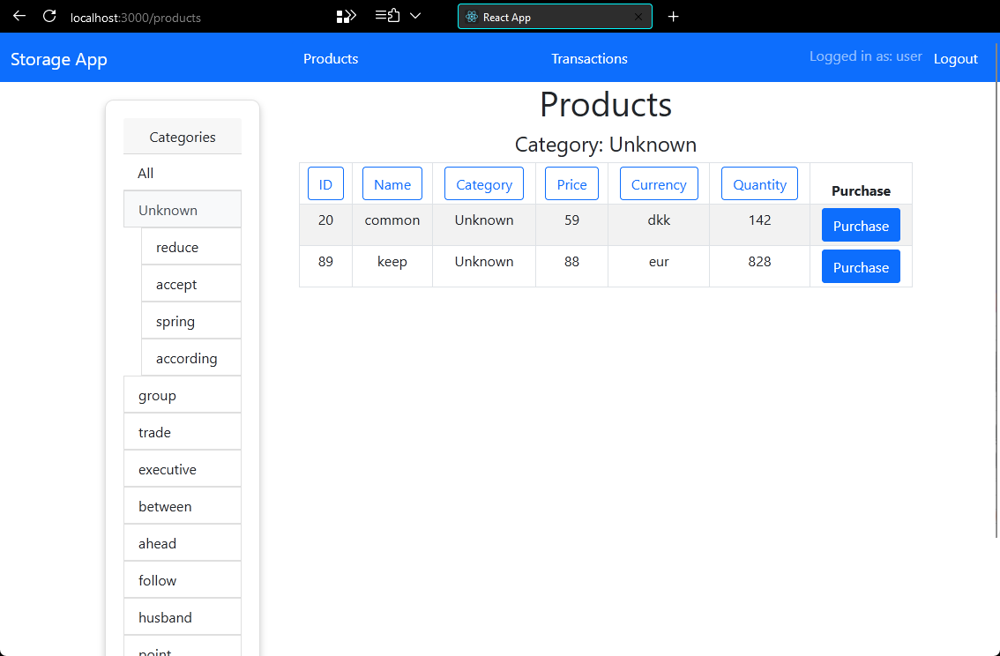
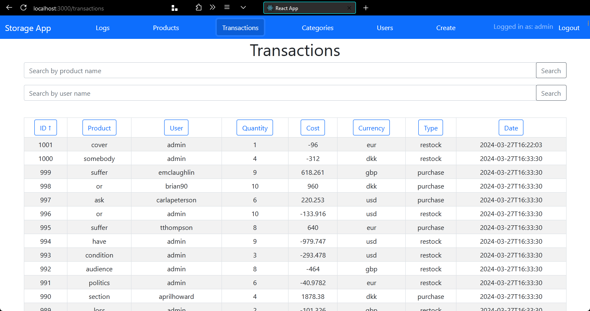
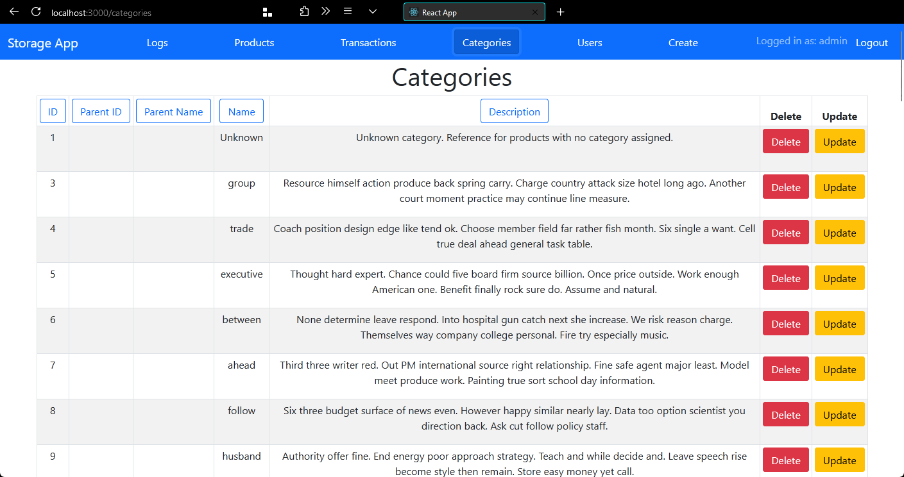
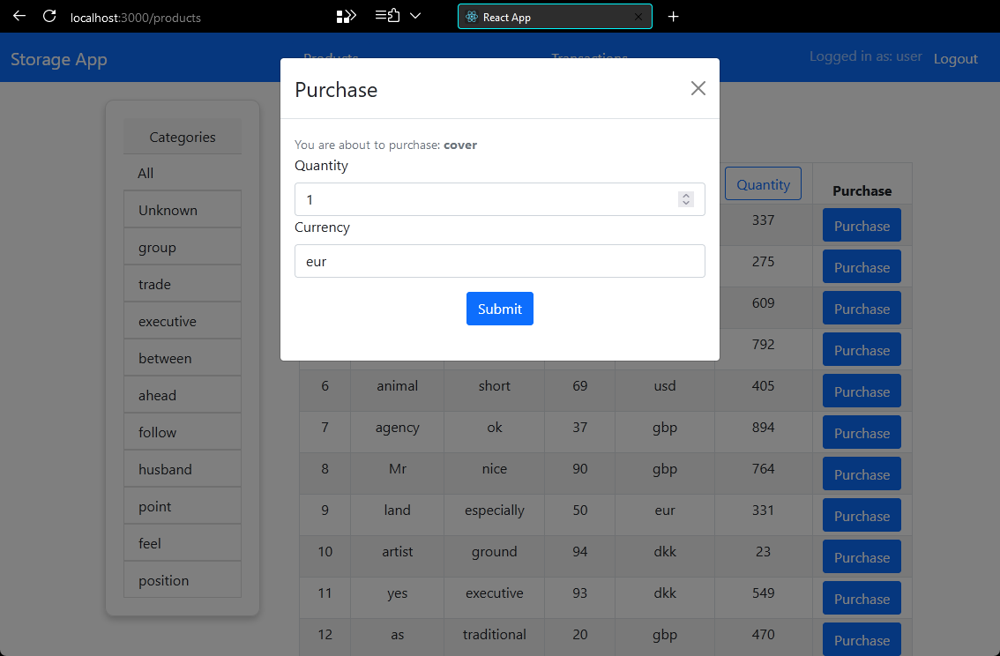
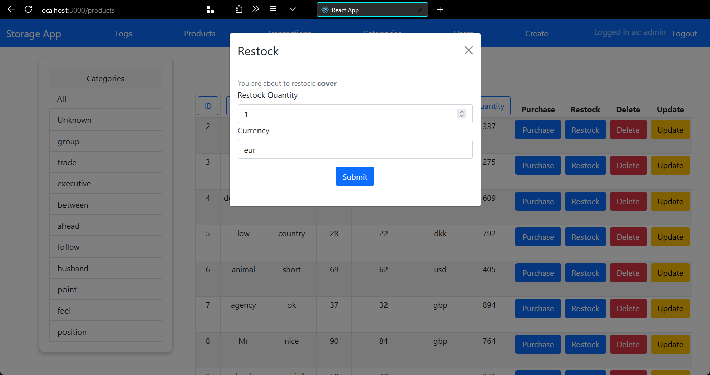
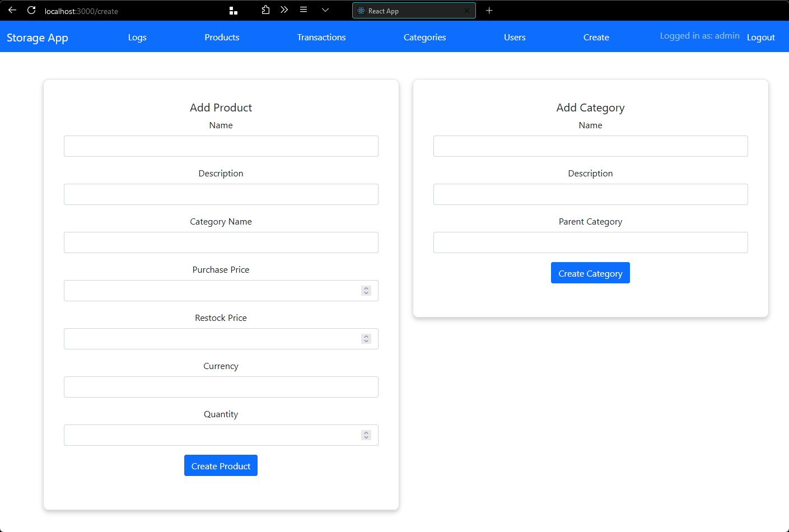
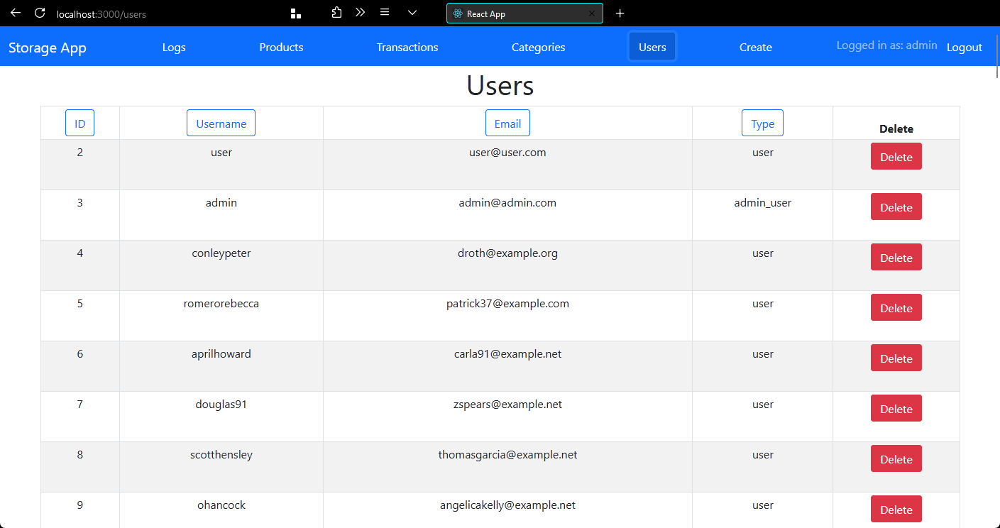
